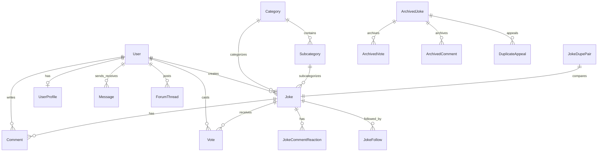

# BannedFromHeaven (BFH) — System Architecture & Developer Guide

> **Quick AI Context Reference**: Dense architectural reference for BannedFromHeaven. Read this document first to navigate the codebase and avoid loading unnecessary files.

---

## 1. High-Level Overview

**BannedFromHeaven** is a high-traffic comedy community platform (Sickipedia style) featuring text jokes, image memes, and short video clips with voting, threaded comments, emoji reactions, user reputation, moderation queues, duplicate detection, user-to-user messaging, discussion forums, and administration tools.

```
                         [ Cloudflare / Internet ]
                                    │
                                    ▼
                         [ Traefik Reverse Proxy ]
              (HTTPS, SSL Certs, Canonical 301 Domain Redirects)
                   │                        │                 │
     ┌─────────────┴────────────┐           │                 │
     ▼                          ▼           ▼                 ▼
[ bannedfromheaven ]     [ bfh_nginx ]   [ bfh_tusd ]   [ sqlite-web ]
Port 8000 (Gunicorn)     Port 8080       Port 8080      Port 8080 (Admin UI)
Flask Core Web App       Media Delivery  Resumable      jokesdb.bannedfromheaven.com
                         /uploads/       Uploads
                         /clips/            │
                         /clip_thumbs/      ▼
                                    [ bfh_processor ]
                                    Port 8080 (Internal)
                                    Upload Hook & Transcoder
                                    (ffmpeg, Pillow, /hooks/tusd)
```

---

## 2. Docker & Network Architecture

The stack runs via Docker Compose (`docker-compose.yaml`) across two external Docker bridge networks (`traefik` and `bannedfromheaven`):

| Container Name | Base Image / Build | Internal IP | External Routing (Traefik / Nginx) | Purpose |
| :--- | :--- | :--- | :--- | :--- |
| `bannedfromheaven` | `python:3.12-slim` (Gunicorn 2w/4t) | `192.168.4.2` / `192.168.2.36` | `bannedfromheaven.com` (port 8000) | Main Flask web application, routing, auth, templates, API |
| `bannedfromheaven_nginx` | `nginx:alpine` | `192.168.2.38` | `media.bannedfromheaven.com` (port 8080) | High-performance static media delivery (`/uploads/`, `/clips/`, `/clip_thumbs/`) with immutable caching |
| `bannedfromheaven_tusd` | `tusproject/tusd:latest` | `192.168.4.3` / `192.168.2.39` | `${UPLOAD_DOMAIN}` (port 8080) | Resumable chunked file upload server (TUS protocol, 1GB max limit) |
| `bannedfromheaven_processor` | `bannedfromheaven:latest` | `192.168.4.4` | Internal only (port 8080) | Background webhook consumer (`app.upload_worker`); processes raw TUSD files via ffmpeg & Pillow, then finalizes via Flask API |
| `bannedfromheaven_db` | `coleifer/sqlite-web` | `192.168.2.40` | `jokesdb.bannedfromheaven.com` / `jokesdb.supergalley.com` | Protected SQLite web viewer interface |

### Domain & Redirect Rules
- **Canonical Apex**: `https://bannedfromheaven.com`
- **Permanent 301 Redirects**: Both Traefik and Flask `before_request` enforce 301 redirects for:
  - `www.bannedfromheaven.com/*` -> `https://bannedfromheaven.com/*`
  - `jokes.supergalley.com/*` -> `https://bannedfromheaven.com/*`
  - HTTP -> HTTPS

---

## 3. Directory & File Structure

```
/home/supergalley/docker/BannedFromHeaven/
├── Dockerfile                   # Python 3.12, ffmpeg, Gunicorn production container
├── docker-compose.yaml          # Multi-container orchestration (Flask, Nginx, TUSD, Worker, DB Web)
├── requirements.txt             # Python dependencies (Flask, SQLAlchemy, Login, Pillow, Bleach, etc.)
├── wsgi.py                      # WSGI entrypoint for Gunicorn (`wsgi:app`)
├── seed_subcategories.py        # One-shot database seeder for category topics
├── banning.log                  # Persistent audit log for admin user bans and IP wipes
│
├── nginx/
│   └── nginx.conf               # Media caching & byte-range streaming config
│
├── data/                        # Persistent shared volume
│   ├── jokes.db                 # SQLite primary database
│   ├── jokes.mbed               # Binary L2-normalized float32 vector index for embeddings
│   ├── embed_outbox/            # Durable file queue for remote X4 text embedding worker
│   ├── uploads/                 # Processed meme images (served by Nginx)
│   ├── clips/                   # Transcoded MP4 video clips (served by Nginx)
│   ├── clip_thumbs/             # Extracted video thumbnail JPGs (served by Nginx)
│   └── tusd/                    # Temporary in-flight TUS chunks
│
└── app/
    ├── __init__.py              # Application factory (`create_app`), DB init, context processors, SEO, 301s
    ├── models.py                # Complete SQLAlchemy data models (50+ fields & relations)
    ├── routes.py                # Main Blueprint: joke browsing, submission, search, voting, comments, moderation
    ├── auth.py                  # Auth Blueprint: login, registration, email verify holding pen, Cloudflare Turnstile
    ├── admin.py                 # Admin Blueprint: dashboard, user management, banning, category editor, settings
    ├── forum.py                 # Forum Blueprint: threads, nested quotes, emoji reactions, read states
    ├── duplicates.py            # De-duplication logic, soft-archiving, restore, appeals, audit logging
    ├── similarity.py            # Fast fuzzy matching (SequenceMatcher) & remote embedding lookup
    ├── mbed_index.py            # Pure-Python binary `.mbed` vector index parser & similarity search
    ├── embed_outbox.py          # File queue writer for async background embedding sync
    ├── upload_worker.py         # Webhook server for TUSD post-finish events & media pipeline
    ├── security.py              # IP detection (Cloudflare/Proxy headers), IP blocking, brute-force rate limits
    ├── banning.py               # Blacklist checks (email, IP, username) & ban audit logs
    ├── comment_reads.py         # Unseen comment tracking & green glow badges
    ├── follows.py               # Post follow tracking & cyan glow badges
    ├── mailer.py                # SMTP client for local postfix mailserver (`mail.supergalley.com:25`)
    ├── static/                  # CSS, JS, site logos, sprites, PWA manifest, seasonal assets
    └── templates/               # Jinja2 HTML templates
```

---

## 4. Database Schema Summary (`app/models.py`)

All models inherit from Flask-SQLAlchemy `db.Model` stored in `/data/jokes.db`.



### Core Entities
1. **`User` / `UserProfile`**: Auth, password hashes (`generate_password_hash`), reputation score, ban status (`ban_until`), moderator/admin flags, appeal permission flags (`duplicate_appeals_banned`).
2. **`PendingRegistration`**: Holding pen for signups. Holds username, email, password hash, 6-digit code, and secret token. User row is **only** created after email verification.
3. **`BlacklistEntry` / `LoginAudit` / `LoginEvent`**: Global bans (IP, email, username) and detailed authentication tracking.
4. **`Category` / `Subcategory` / `CategoryModSuggestion`**: 2-level taxonomy. Moderators can propose additions/removals for admin approval.
5. **`Joke`**: Core post model:
   - Types: Text (`is_meme=False, is_clip=False`), Meme (`is_meme=True`, `image_filename`), Clip (`is_clip=True`, `video_filename`, `video_thumb`, `video_duration`, `video_size`).
   - Moderation: `review_status` (`approved`, `pending`, `rejected`), `is_quarantined`, `quarantine_locked`, `reject_reasons`.
   - Engagement: `score` (computed from votes), `salute_to` (attribution username).
6. **`JokeDraft`**: Auto-saved/editable drafts per user before publishing.
7. **`Vote`**: `value` (+1 standard upvote, +2 double-upvote, -1 downvote). Affects `joke.score` and author's `user.reputation`.
8. **`Comment` / `JokeCommentReaction`**: Threaded comments with quote support (`quoted_comment_id`) and 7 emoji reaction types (`like`, `love`, `care`, `haha`, `wow`, `sad`, `angry`).
9. **`JokeCommentRead` & `JokeFollow`**: Glow notification engine. Green glow for author unseen comments; cyan glow for followed posts.
10. **`Message` & `MessageBlock`**: Direct message inbox/outbox between users with blocking.
11. **`ForumThread`, `ForumReply`, `ForumReaction`, `ForumThreadRead`**: Complete forum boards with unread indicator logic.
12. **`SiteSettings`**: Runtime singleton for rate limits (max jokes/hr, max jokes/day), pinned banner, announcements marquee (JSON items & theme), and seasonal snow/fireworks toggles.

### De-duplication & Soft-Archive Entities
- **`JokeDupePair`**: Records candidate pairs (`joke_older_id`, `joke_newer_id`, `score`, `method`, `status`: `pending`, `resolved_delete_newer`, `not_dupe`).
- **`ArchivedJoke`, `ArchivedVote`, `ArchivedComment`, `ArchivedCommentReaction`**: When a joke is marked as a duplicate, it is removed from `jokes` and moved to `archived_jokes`. Author reputation is reversed, votes and comments are saved.
- **`DuplicateAppeal`**: Allows authors of archived duplicates to appeal to admins. Restoring moves all rows back into live tables and restores reputation.
- **`DupeModerationLog`**: Audit trail of all moderator de-duplication actions.

---

## 5. Core Subsystems & Workflows

### A. Joke Submission & Resumable Media Flow
1. **Text Jokes**:
   - Submitted via standard POST to `/submit`.
   - Evaluated against `hard_block_recent_duplicate()` (blocks identical re-submits in <48h).
   - Evaluated against `find_similar_jokes()` (combines `difflib.SequenceMatcher` + unit-vector cosine search in `jokes.mbed`).
   - If potential match found, prompts user on `submit_similar.html` before final commit.
   - Enqueues new joke to `embed_outbox.py` for background vector indexing.
2. **Memes & Video Clips**:
   - Client-side uses TUSD resumable protocol to `${UPLOAD_DOMAIN}`.
   - `bannedfromheaven_tusd` writes chunks to `/data/tusd/`.
   - On completion, TUSD sends webhook to `bannedfromheaven_processor` (`/hooks/tusd`).
   - Processor executes `process_meme_image` (Pillow optimization) or `process_clip_video` (ffmpeg MP4 transcoding + thumbnail extraction).
   - Processor calls `/api/uploads/finalize` on Flask using `UPLOADS_SHARED_SECRET`.

### B. Similarity & Vector Indexing (`.mbed` Format)
- **Binary Format (`app/mbed_index.py`)**: Custom pure-Python L2-normalized float32 index:
  - Header: Magic `BFMB` (4B), Version `1` (u32), Count `N` (u32), Dimension `D` (u32), Model Name (string), Timestamp (u64).
  - Data: `N` IDs (u32) + `N * D` floats (f32).
  - Search: Cosine similarity is computed via dot product in linear time without NumPy.
- **Remote Embed Proxy**: `similarity.remote_embed()` calls `BFH_EMBED_PROXY_URL` (Ollama on remote host/X4 node) to embed incoming joke queries.

### C. Moderation & Quarantine System
- **Quarantine**: Moderators can quarantine offensive/illegal/spam jokes with structured tags (`QUARANTINE_REASONS`: `Copied`, `Legally dangerous`, `Not a joke`, `Personal attack`, `Unfunny Bandwagon`, `Wasp-esque`).
- **Duplicate Review Queue**: `/moderation/duplicates` presents side-by-side comparisons of flagged pairs with confidence filters (`≥90% High`, `≥75% Medium`).

### D. Security & Anti-Abuse
- **Client IP Extraction**: `security.get_client_ip()` checks `CF-Connecting-IP` -> `True-Client-IP` -> `X-Forwarded-For` -> `remote_addr`.
- **Brute-Force Rate Limiting**: `security.too_many_failed_logins()` checks `LoginAudit` for failures within 10 minutes (limit: 8).
- **Turnstile Captcha**: Cloudflare verification on register and password reset.

---

## 6. Key Configuration & Environment Variables

| Variable | Default / Container Path | Description |
| :--- | :--- | :--- |
| `DOMAIN` | `bannedfromheaven.com` | Primary canonical domain |
| `CANONICAL_HOST` | `bannedfromheaven.com` | Hostname for 301 redirects |
| `MEDIA_DOMAIN` / `MEDIA_BASE` | `media.bannedfromheaven.com` | Public CDN/Nginx base for images and clips |
| `UPLOAD_DOMAIN` | `upload.bannedfromheaven.com` | TUSD endpoint for uploads |
| `UPLOADS_SHARED_SECRET` | Secret string | Token for processor-to-Flask internal API |
| `BFH_EMBED_PROXY_URL` | `http://192.168.4.1:18765/embed` | HTTP proxy to Ollama on host/X4 node |
| `BFH_MBED_PATH` | `/data/jokes.mbed` | Path to text embeddings index file |
| `BFH_EMBED_OUTBOX` | `/data/embed_outbox` | Directory queue for outgoing text embeddings |
| `MAIL_SMTP_HOST` | `mail.supergalley.com` | Internal Postfix SMTP server |
| `MAIL_SMTP_PORT` | `25` | SMTP port |
| `TURNSTILE_SITE_KEY` | Env key | Cloudflare Turnstile public key |
| `TURNSTILE_SECRET_KEY`| Env key | Cloudflare Turnstile private key |
| `BANNING_LOG_PATH` | `/data/banning.log` | Path for disk-based user ban dump |

---

## 7. Developer Utility Scripts

- **`./xanderMake`**: Builds production image `bannedfromheaven:latest`.
- **`./ClearUsersPassword <username>`**: Resets a user's password directly in `jokes.db` to `ChangeMe123`.
- **`./addjoketype <slug> <name>`**: Adds a new top-level category directly via docker exec.
- **`python seed_subcategories.py`**: Seeds the database with curated subcategory tags across all existing categories.
